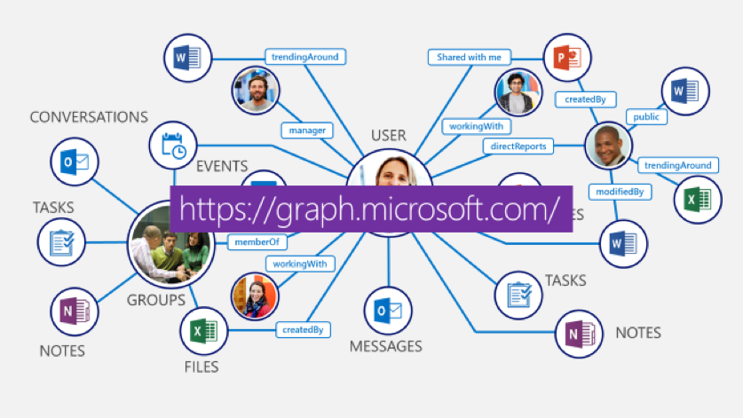

# MS Graph API plugin for NativeScript

***NOTE:*** **This library is currently being developed and is pre-alpha at this time**

<br/>

Manage Office 365 Users, Groups, Mail, Calendars, Contacts, Files,
Tasks, People, Notes and more — all from a single endpoint


## Prerequisites

You should have an Office 365 Account admin account. If you don't have one yet, you can get a [free trial here](https://products.office.com/en-us/try).

Register your mobile app [here](https://apps.dev.microsoft.com). This will require you to login with your Office 365 account. You can then click the big "Add an app" button and go through the steps listed there, starting with giving you app a name. On the app creation screen, you need to do 3 things:

1. Click the "Add Platform" button and select "Mobile application"
2. Copy the "Client Id" GUID from the Mobile Application section.
3. Click "Save" at the bottom. 


## Setup

Add TypeScript to your NativeScript project if you don't already have it added. While this is not a requirement, it's highly recommended. If you want to watch a video on how to convert your existing JavaScript based NativeScript app to TypeScript, [watch it here](https://youtu.be/2JDXnduTlgs).

From the command prompt go to your app's root folder and execute:

```
tns plugin add nativescript-msgraph
```

## Usage

coming soon

